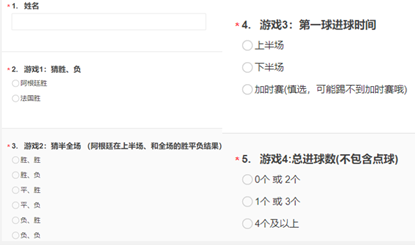
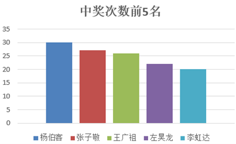
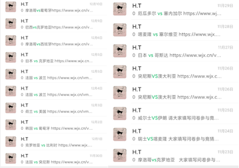
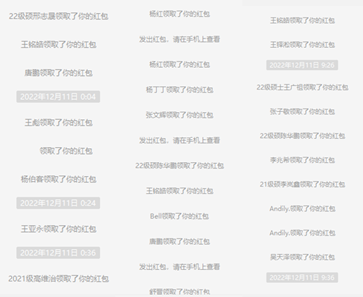
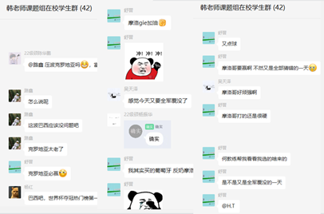

  11月，一场突如其来的疫情打破了在校同学们规律的校园生活，在疫情期间为了丰富同学们的生活、缓解居家学习的压力，采油工艺课题组于11月23日-12月18日期间线上举行“世界杯有奖竞猜”系列活动。   活动设置多种竞猜方式，如“胜平负”、“首球时间”、“半全场”、“总进球数”等，老师为同学们准备了丰厚的奖励，每个人都参与了进来，并领取到了奖励，为单调乏味的居家生活增添了乐趣。

* * *

* * *

  本次活动共发布比赛问卷：19场；累计参加：962人次；发出红包：10500元。其中，中奖次数最多的前五位“预言家”，分别为： 1.杨伯客：30次 2.张子敬：27次 3.王广祖：26次 4.左昊龙：22次 5.李虹达：20次 

* * *

  
