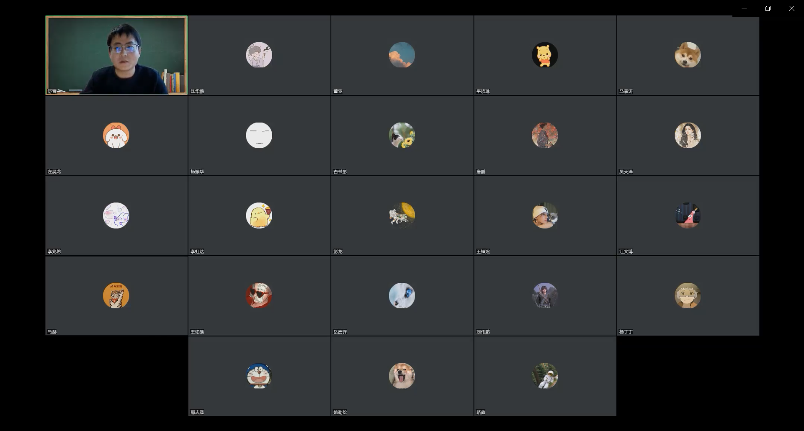
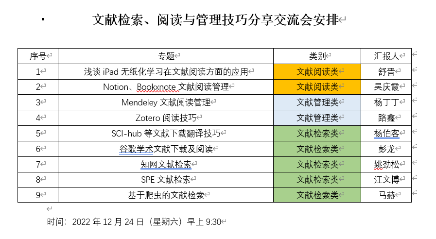

        为了帮助研一同学尽早地进入科研节奏，为了帮助研二同学在开题中能够更好地调研文献，为了全组同学相互交流，共同进步。2022年12月24日，根据韩老师的倡议，我们组织了第一次“文献检索、阅读与管理技巧分享交流会”。

        会议由博21级舒晋主持，舒晋、吴庆霞、杨丁丁、路鑫、杨伯客、彭龙、姚劲松、江文博、马赫九位同学主讲，各自分享了文献检索、文献管理、文献阅读的一些技巧，让大家对文献调研有了一些新的认识。交流会的具体流程如下

        会议视频的百度网盘链接见附件。最后，希望大家都能有所收获。

链接：[https://pan.baidu.com/s/1PW2fhnw-bKU0JstMG21QQA](https://pan.baidu.com/s/1PW2fhnw-bKU0JstMG21QQA) 提取码：d2jl --来自百度网盘超级会员V6的分享
