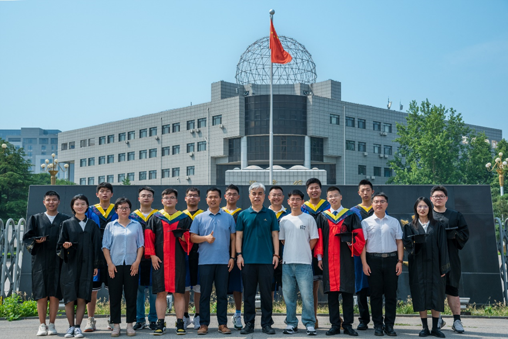
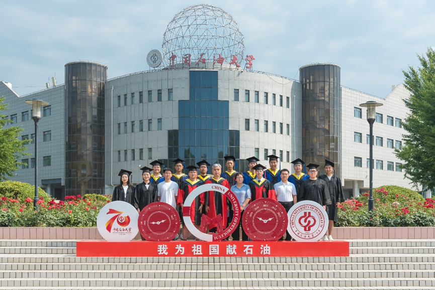
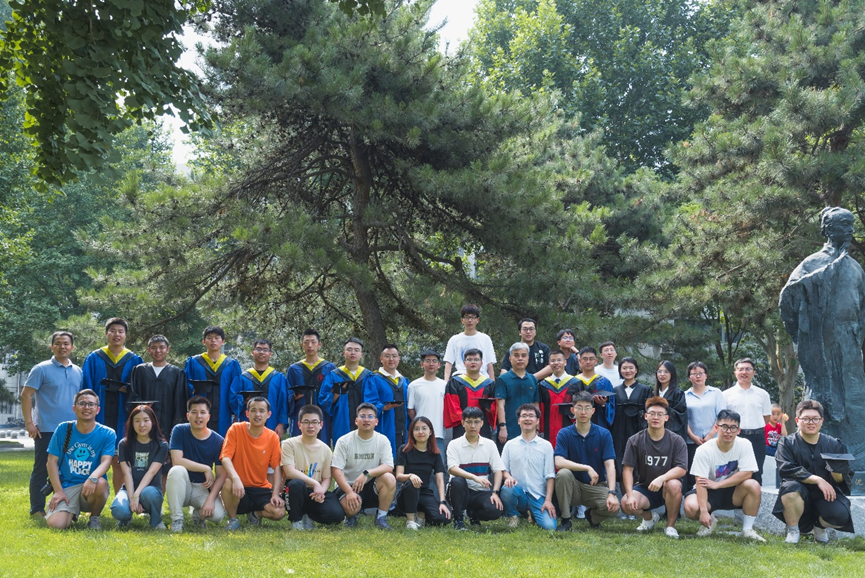
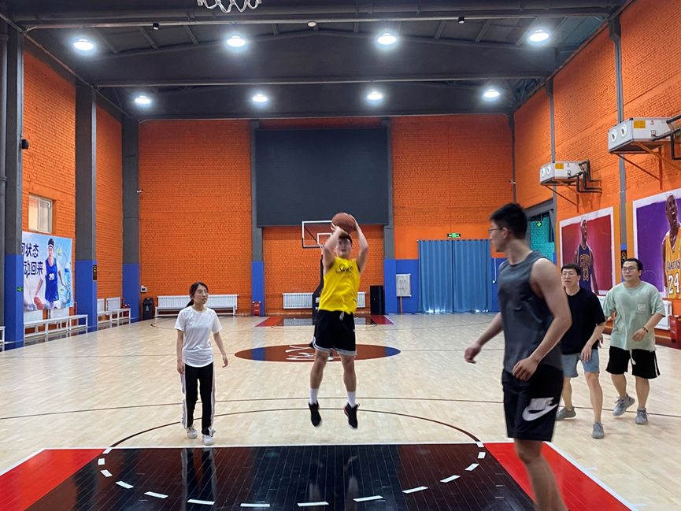
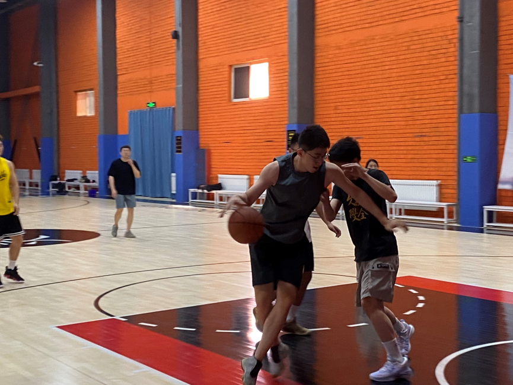
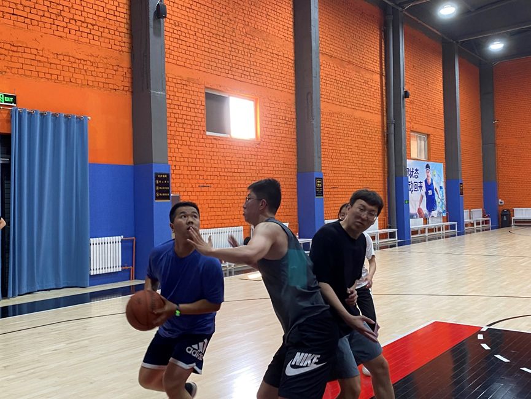
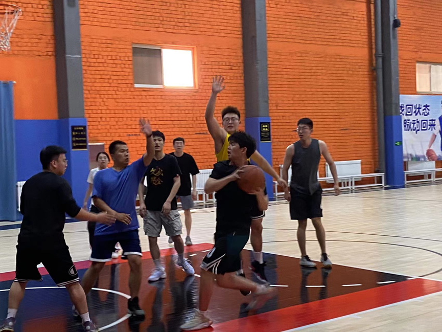

## ——采油采气课题组欢送23届毕业生

六月是一个充满了鲜花和欢笑的季节，也是一个充满留念和憧憬的季节，中国石油大学（北京）采油采气课题组又将送走一批优秀的毕业生。为此，课题组在6月24日组织了校园毕业照拍摄和篮球友谊赛活动。

本、硕、博毕业生与韩老师、梁师兄合照

（石油大学东门）

本、硕、博毕业生与韩老师合照

（图书馆、喷泉旁）

课题组大合照

（沈括雕像旁）

拍完毕业照后，下午举办了篮球友谊赛，在校生和毕业生们都在球场上肆意挥洒汗水，珍惜难得的相聚时光。

龙队超级跳投

吴博控球过半场

路博篮下对抗

梁师兄持球攻入篮下

兴亮师兄持球上篮，大伙积极防守

曹导的笑好有感染力，快教教朱玮涛师兄^-^

最后，

山水一程，江湖再见！

祝愿各位毕业生心存高远，脚踏实地，不负韶华，追梦前行，用在采油采气课题组积攒的学识去拓宽自己人生的道路，在各自的工作岗位上发光发热，也欢迎各位师兄师姐常回来看看！
