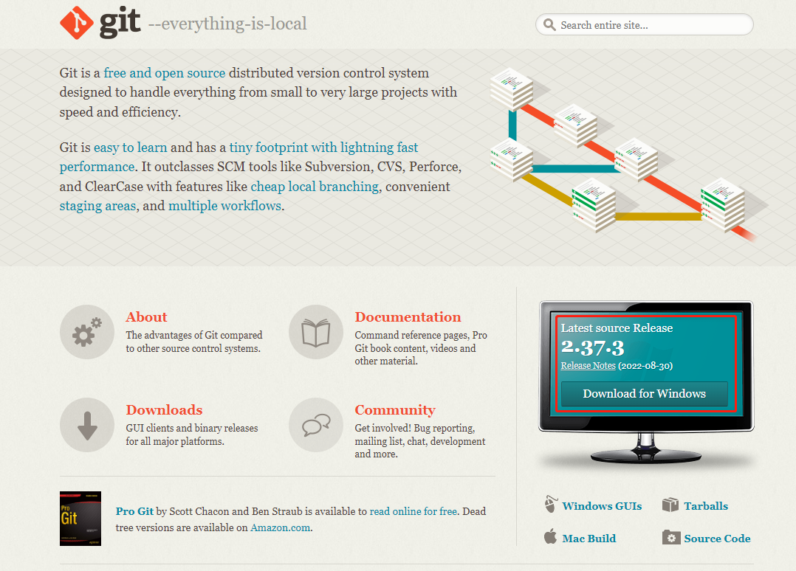
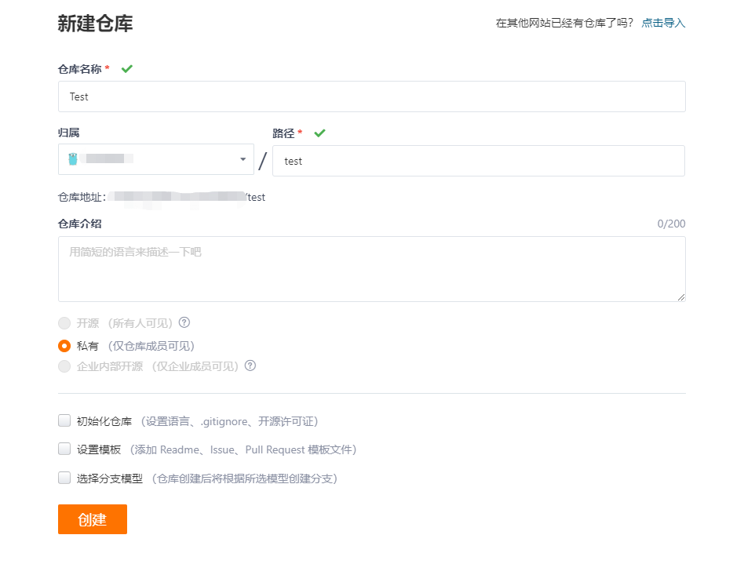
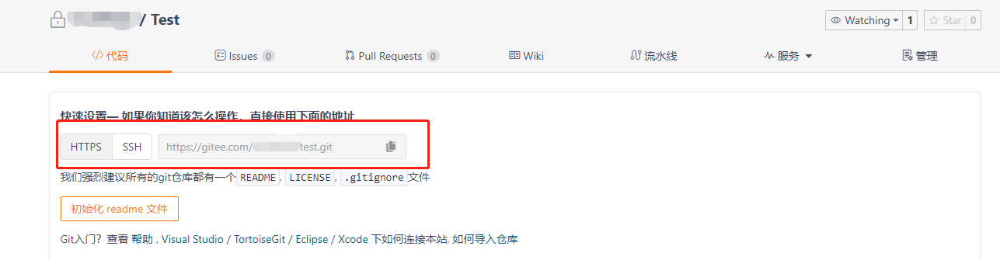
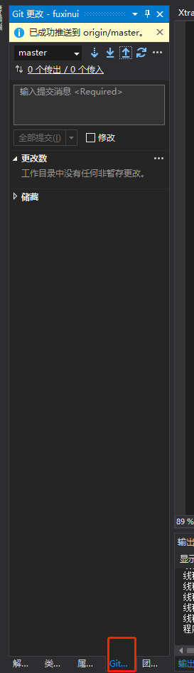
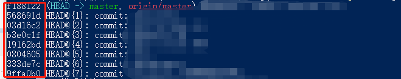

# Git使用快速上手指南

## 1.什么是Git


Git是一个开源的分布式版本控制系统，可以有效、高速地处理从很小到非常大的项目版本管理。方便团队开发者来进行合作开发版本同步以及版本的管理，提高开发的效率。

## 2.安装Git环境

- 打开git官网

```csharp
https://git-scm.com/
```

- 下载Git安装包



- 直接安装即可。

## 3.代码托管网站推荐

因为Git的使用需要用到服务器来实现多用户的代码同步，为了保证Git服务的高效和稳定性， 我这里推荐使用第三方的代码托管网站来使用，首先推荐的是github，但是鉴于国内对github很难访问，这里我将教大家国内最大的代码托管网站gitee的使用。

首先是gitee的官网是：

```csharp
https://gitee.com/
```

首先是注册账号，注册完账号，我们新建项目：



创建完毕后，到你的项目目录按住shift+鼠标右键，点击”在此处打开PowerShell窗口”

如果你是第一次使用git，这里首先要对git进行全局设置。依次输入以下两条命令并回车：

```csharp
git config --global user.name "你的用户名"
git config --global user.email "注册的邮箱"
```

接着把本地项目的文件全部上传到托管网站里步骤为:

```csharp
git add .
git commit -m "first commit"
git git remote add origin 你仓库的地址
git push -u origin "master"
```

其中你仓库的地址在这里：



这样我们的代码就上传到服务器中了。

## 3.Git日常使用命令

首先是当你完成了代码改动之后，想要把你的改动后的版本同步到服务器上，这里就需要使用提交命令：

```csharp
//首先是添加变动,这里是直接把项目里所有变动全部添加暂存
git add .
//接下来是提交变动
git commit -m " "
//上面双引号内需要填写你对代码修改的描述方便之后对版本进行辨别
//最后把提交上传到服务器中
git push -u origin "master"
```

这样你就完成了对代码修改的上传

如果你团队其他人想同步你对代码的修改该怎么办呢只需要输入以下代码就能从服务器中拉去你的修改：

```csharp
git pull
```

要注意的事情是你们在协作的时候不能同时对一个文件进行修改，这样会导致版本冲突无法合并代码。想要解决冲突只能手动修改代码。

如果你使用的是VS，你可以使用VS自带的Git管理工具来进行代码的提交和拉取



首先你要填写版本修改信息，然后点击全部提交，提交之后点击最上方向上的箭头进行推送，如果想要同步代码就点击最上方箭头向下的按钮进行拉取。

## 4.版本回退

我们有时候会遇到一些无法解决的恶性BUG，想要把代码变回上次可以运行成功的状态，这时候就可以用到git的版本回退功能。

首先我们输入git reflog指令就能看到我们之前提交的所有版本，选择你想要退回的版本找到对应的版本号，版本号在这里：



然后我们输入

```jsx
git reset --hard 版本号
```

就能退回到你想退回的版本，但是如果你退回的版本早于你服务器里远程的版本这里需要强制推送一下来覆盖远程服务器的代码这样就要使用git push -f origin master。

同时你要告诉你仓库的其他成员重新git clone远程服务器的代码到本地。
