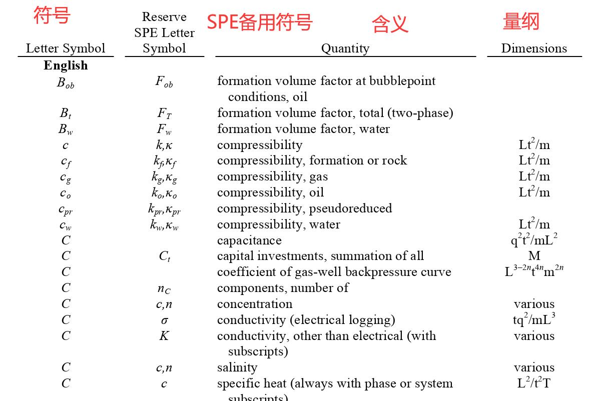

大家在写作SPE论文的时候应该遵循SPE的写作规范，以下是我在SPE官网找到的一些资料： 来源：[https://mc.manuscriptcentral.com/spere](https://mc.manuscriptcentral.com/spere)

## 1.SPE符号标准（英文原文）

- 大家可以像查字典一样用检索的方式寻找自己所需的符号，里面的表格基本涉及了SPE所需的所有符号。
- 资料：[symbols.pdf](https://aiwellbore.com/wp-content/uploads/2022/10/symbols.pdf "symbols")
- 示例：

## 2.SPE写作规范指导书（英文原文）

- 资料：[\_ SPE-Style-Guide.pdf](https://aiwellbore.com/wp-content/uploads/2022/10/SPE-Style-Guide.pdf "_ SPE-Style-Guide")

## 3.个人总结（中文）

另外分享一下个人总结的SPE写作规范指导书（中文）

- 资料：[SPE写作指导总结.docx](https://aiwellbore.com/wp-content/uploads/2022/10/SPE写作指导总结.docx "SPE写作指导总结")
