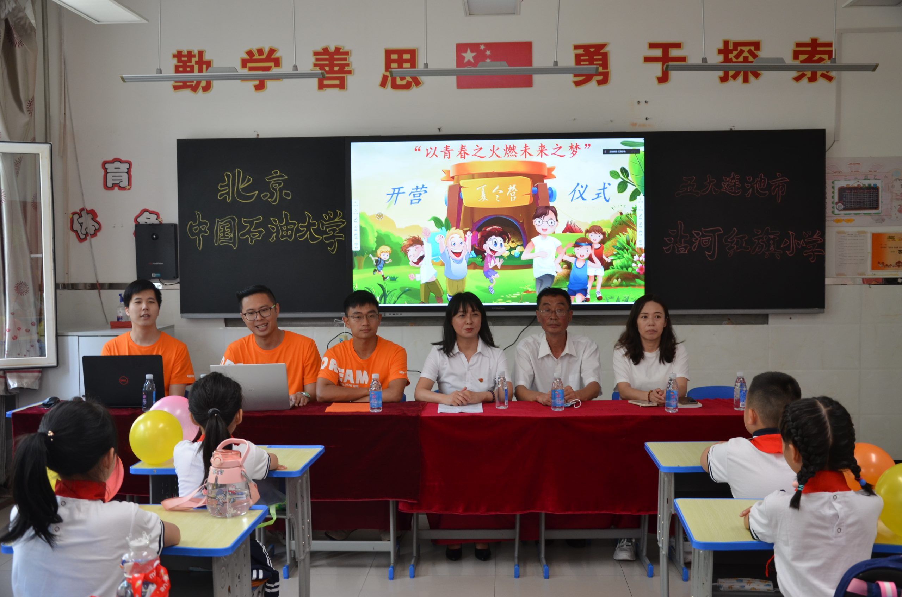
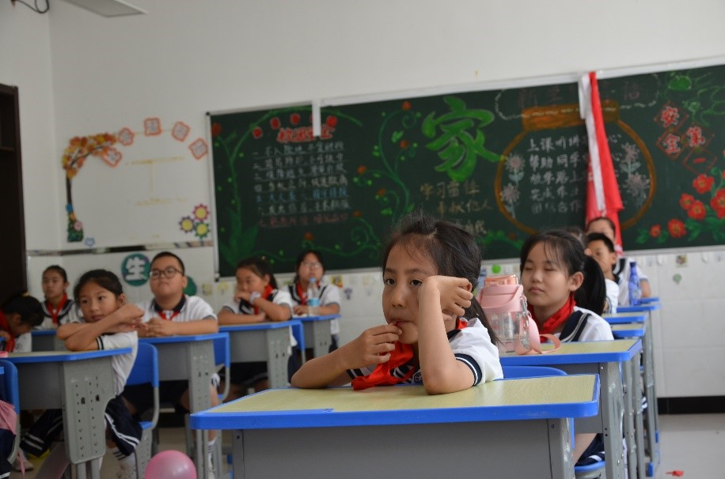
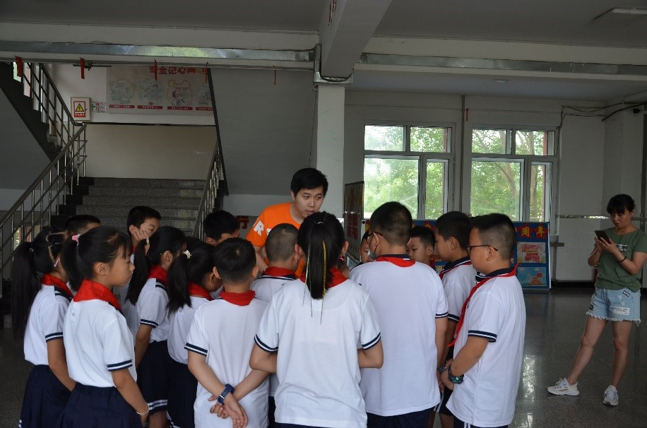
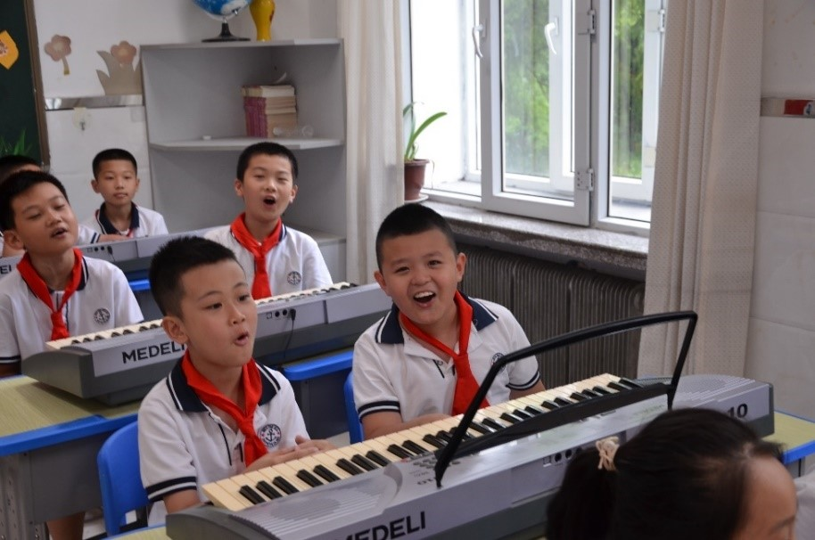

        导语：为进一步加强对农村留守儿童、城市随迁子女等群体的关心与爱护，聚焦未成年人保护和青少年健康成长，以实际行动塑造青少年理想信念与价值观，中国石油大学（北京）石油工程学院联合中国石油勘探开发研究院采油采气工程研究所，结合北京市红色“1+1”党团建设，共同组建“油你油我”志愿服务队，于2022年7月16日-25日期间深入黑龙江省五大连池市沾河林业局红旗小学开展“石油科普进校园，点燃少年能源梦”为主题的支教活动。本次活动得到北京中国石油大学基金会、北京惠科公益基金会的大力支持。

        7月16日上午8时，“以青春之火，燃未来之梦”夏令营开营仪式在红旗小学举行，红旗小学校领导、“油你油我”志愿服务队队员及24名同学线下参会，中国石油大学（北京）韩国庆教授、中国石油勘探开发研究院采油采气工程研究所蒋卫东书记通过视频连线的方式线上参加开营仪式。

        开营仪式上，红旗小学副校长张春玲首先对“油你油我”志愿服务队来校开展支教活动表示感谢，并对参与夏令营活动的成员送上了殷切的期望。她表示，青少年是祖国和民族的希望，肩负着振兴中华的时代重任。关心青少年健康成长，是党和国家以及社会各界的重大责任和义务。希望同学们在夏令营中相互学习，相互帮助，在活动中增长见识，磨砺意志，培养团结协作的意识，让这段时光，成为人生中一次特殊而难忘的学习经历。中国石油勘探开发研究院采油采气工程研究所蒋卫东书记，介绍了企业党支部与学校党支部合作共建，互相促进的背景，希望在企业与学校的共同努力下，通过本次志愿活动，能够让孩子们走进石油行业，了解石油知识，树立远大理想。仪式最后，学生代表代表吕婧竹同学代表夏令营全体成员发言，表达了自己与同学们对科学技术有着浓厚的兴趣，希望通过这次夏令营了解更多的能源知识，未来能够为我国的现代化建设和社会主义事业做出自己的贡献，并带领全体同学宣誓，在夏令营活动中遵守纪律、服从管理，快乐体验，快乐成长。

图为红旗小学副校长张春玲致辞。中国青年网通讯员 江文博供图

        本次夏令营活动，主要由“石油探秘”知识讲座，“科学在身边”科普实验以及“运动强健体魄，艺木陶冶情操”文体课三个部分组成。

        开营第一课为“石油探秘”知识讲座，由韩国庆教授主讲。韩教授从石油与人类社会的变化讲起，讲述了石油一步一步带领人类走向工业时代，驱动着人类文明车轮高速前进；讲述了石油在地下的“真面目”，以及如何经过加工才能被人类更好的利用；讲述了“石油人”在各种极端工作环境下的工作，从荒漠到高原，从陆地向深海，用自己的汗水为祖国“加油添气”。听课过程中，同学们稚嫩的眼神中充满了对石油人精神的敬佩和感动。

图为同学们认真听讲座。中国青年网通讯员 江文博供图

         “科学在身边”科普实验课上，杨伯客博士首先为大家讲解了“世界是由物质组成的”这一基本概念，然后带领同学们进行了“扩散实验”“溶解实验”“乳化实验”“表面张力实验”“岩石润湿性实验”等一系列科普实验，教会了同学们对照实验的基本方法，为同学们打开了科学世界的大门，让同学们体验到了科学的魅力。

图为“科学在身边”科普实验课。中国青年网通讯员 江文博供图

    “运动强健体魄，艺术陶冶情操”。为了让同学们体验艺术和运动的乐趣，志愿团队的舒晋、张子敬、何天同学为同学们设计了别开生面的音乐课程、乒乓球课程。音乐课由舒晋同学、张子敬同学主讲，包括一节导论课、一节器乐课以及两节声乐课。通过轻松愉快的音乐小游戏，寓教于乐，让同学们对音乐产生兴趣；通过独唱、合唱的方式让同学们积极主动地表现自己，增强自信心；通过分组分队比赛的方式增强同学们的集体荣誉感和奉献精神。体育课由中国石油大学（北京）乒乓球队队长——何天同学主讲。他从入门基础讲起，手把手纠正技术动作，同学们学的有模有样，在球桌前度过了快乐的时光。最后一节体育课，“油你油我”志愿服务队成员组织了一场“趣味运动会”，带领小朋友们走出课堂，开展了一系列趣味游戏活动，通过“老鹰捉小鸡”“击鼓传花”“老狼、老狼几点了”等游戏，志愿者们与同学们打成一片，玩得不亦乐乎。

图为“科学在身边”科普实验课。中国青年网通讯员 江文博供图 

        童年，是一个人生命的底色，对世界和情感的最初经验，都来自于童年。童年不该只有书本和课堂，在盛夏中奔跑的记忆，也应该留在童年中。本次夏令营活动，想带给孩子们的不仅是科学知识、艺术情操和强健的身体，更想给孩子们传达积极向上的人生态度和面对困难时拼搏的勇气，这些人生的智慧都蕴藏在每一次的课堂中，希望同学们能把这次夏令营活动中收获的优良品质播撒到今后的学习和生活中去，用扎扎实实的努力和汗水去浇灌它、培育它，让它繁花似锦、硕果累累！

[（更多…）](https://aiwellbore.com/?p=3788#more-3788)
