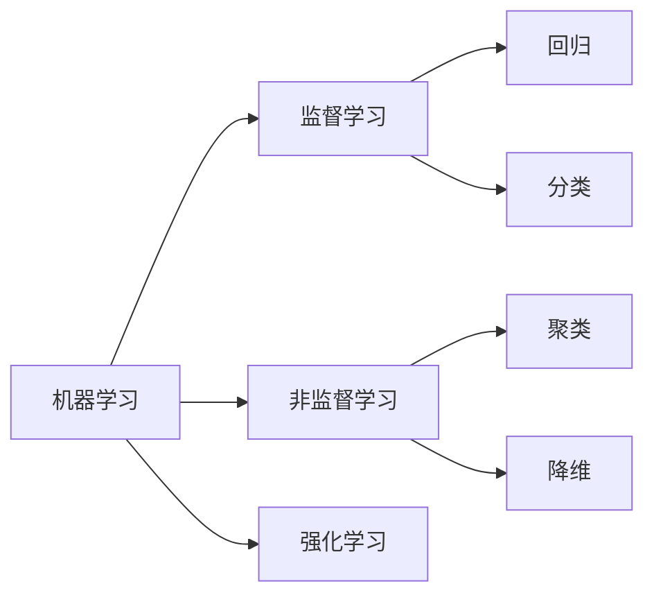

[https://blog.csdn.net/weixin\_45638544/article/details/107429224](https://blog.csdn.net/weixin_45638544/article/details/107429224) @[TOC](石油工程：一文入门机器学习，以测井岩性分类预测为例)

# 1 前言

## 1.1 机器学习的相关背景

  
仅为分享知识，写下本文。如有错误，请见谅，欢迎批评！  

随着技术的迭代，传统技术对于石油工业的支持有着一定的制约，基于数据驱动的机器学习这一数学工具能提供更多的帮助。故此写下本文，不能实现所有的细节，但是可以将整个机器学习的思想大致予以说明。

机器学习是一个数学工具，包括了众多算法，人们熟知的即神经网络（BP）[^1](https://baike.baidu.com/item/%E7%A5%9E%E7%BB%8F%E7%BD%91%E7%BB%9C/174248?fr=aladdin)、支持向量机（SVM）[^2](https://baike.baidu.com/item/%E6%94%AF%E6%8C%81%E5%90%91%E9%87%8F%E6%9C%BA/9683835?fr=aladdin)等等。从应用的目的上可以分为三种，即监督学习、非监督学习、其他（如：强化学习）。

* * *



* * *

三种类型都有其各自的特点及应用场景，这里分别叙述了单纯的从机器学习的角度出发以及结合到石油工程的业务场景当中的直观解释。

| 类型 | 机器学习的理论角度 | 石油工程业务角度 |
| --- | --- | --- |
| 监督学习 | 确定某个状态下的答案 | 如：一定条件下岩性是什么 |
| 非监督学习 | 数据分布的规律 | 如： 两口井间是否存在相似性 |
| 强化学习 | 智能体的规划问题 | 如： 如何布井使得效益最佳 |

大多数的资料都集中在监督学习，以至于大家对于机器学习的认知存在偏差，个人认为资料集中在监督学习的原因可以归结为：与其他相比，监督学习的效果直观，客观性强，便于评价。

## 1.2 机器学习的八股文

机器学习既难又简单，难的地方无需多说，而简单的地方就在于机器学习是有固定的套路的，任何的机器学习都围绕着以下五个部分进行（**第四步主要为神经网络的模型**）：

1. 数据处理：**读取数据   处理操作**
2. 模型设计：**网络结构设计**
3. 训练配置：**优化器   计算机资源配置**
4. 训练过程：**循环调用训练过程   前向传播+损失函数+反向传播**
5. 保存模型：**将训练好的模型保存**

既然知道了这个八股文，那么学习与使用机器学习解决实际问题就简单多了。

本案例中将按照这个顺序，以测井岩性分类举例说明，数据集引用于**University of Kansas Hugoton and Panoma gasfield**[^4](http://www.people.ku.edu/~gbohling/EECS833/)

本案例稍微处理的数据后续应该会上传至附件[https://download.csdn.net/download/weixin\_45638544/12638256](https://download.csdn.net/download/weixin_45638544/12638256)，附件可能会被强制设为收费，如果没找到或不方便的话也可以在这个[超链接](https://gitee.com/mmmahhhhe/blog/raw/master/other/demo/log_classifier/log_data.xlsx)免费下载 [https://gitee.com/mmmahhhhe/blog/raw/master/other/demo/log\_classifier/log\_data.xlsx](https://gitee.com/mmmahhhhe/blog/raw/master/other/demo/log_classifier/log_data.xlsx) 链接在浏览器打开应该会自动下载的，**如果没下载，可以按ctrl+s手动下载，别老问我要数据了q^q**

# 2 模型实战

**本案例比较简单，故此每个小节比较简短，出发点仅为提供一个思路，实际案例可以将每个部分进行特定的扩展。**

## 2.0 导入相关库

本文采用的数据见附件

```python
# 本案例引用的相关库
import tensorflow as tf
from tensorflow.keras import layers
import pandas as pd
import matplotlib.pyplot as plt
```

```python
# 本案例采用的TensorFlow2版本
print(tf.__version__)
print(tf.keras.__version__)
2.1.0
2.2.4-tf
```

## 2.1 数据处理

### 2.1.1 数据读取

```python
# 读取原始数据
log_data = pd.read_excel('log_data.xlsx')
```

```python
# 注意，该代码以ipynb交互式呈现，若以py文件直接运行时可以将
# `log_data`修改为print(log_data)  
# 下文同理
log_data

    Depth   facno   facies  TH  U   K   RHOMAA  UMAA    PHIN
0   13.5    1   Marine  7.653   9.172   1.209   2.776330    10.718131   42.099998
1   14.0    1   Marine  7.794   9.209   1.210   2.741724    10.884575   43.200001
2   14.5    1   Marine  7.567   9.129   1.159   2.698888    10.882272   40.400002
3   15.0    1   Marine  7.296   9.010   1.095   2.698981    13.035485   37.799999
4   15.5    1   Marine  9.105   9.554   1.715   2.710039    12.707702   35.500000
... ... ... ... ... ... ... ... ... ...
919 473.0   1   Marine  10.544  4.183   2.338   2.953034    8.994445    43.599998
920 473.5   1   Marine  10.714  4.289   2.386   2.913379    9.434404    40.000000
921 474.0   1   Marine  10.539  4.193   2.301   2.857787    9.567975    34.400002
922 474.5   1   Marine  10.440  4.145   2.210   2.823199    9.857352    28.500000
923 475.0   1   Marine  10.948  4.329   2.246   2.817633    9.586872    27.000000

924 rows × 9 columns
```

### 2.1.2 缺失值处理

其中`facno` ,`facies`分别代表岩性的类别序号即英文名。`facno` 取值为0至6，其中0为未知的岩性。`facies`中未知的岩性是缺失值，故此进行缺失值处理。

```python
# 将 `facies`列中空值置为  Unknown
log_data['facies'][log_data['facies'].isnull()] = 'Unknown'
```

### 2.1.3 样本类别均衡

> 在不同框架中这部分代码需要各自调整，具体调整起来比较繁琐，因此本例中只是进行了均衡分析，并没有进行相应处理。

输出岩性类型及对应序号

```python
# 6种岩性类型，以及未知类型
# 注：0对应的nan代表未知 Unknown
# 将facies 按照facno分组，储存到列表
group = log_data['facies'].groupby(log_data['facno'])
class_list = []
for id_num, name in group:
    class_list.append([id_num, name.iloc[0]])
```

```python
class_list

[[0, 'Unknown'],
 [1, 'Marine'],
 [2, 'Paralic'],
 [3, 'Floodplain'],
 [4, 'Channel'],
 [5, 'Splay'],
 [6, 'Paleosol']]
```

岩性类别统计

```python
# 统计各个岩性的数量分布
log_data['facies'].value_counts()

Channel       262
Floodplain    232
Paralic       156
Marine        128
Paleosol       66
Unknown        42
Splay          38
Name: facies, dtype: int64
```

机器学习存在各种细节问题，很是困难，幸运的是相互之间不是必要条件，可根据自己的实际需求与能力进行进一步研究。 本案例存在一定的样本不均衡问题，形象的说可以理解成： 假如有100个人，其中n个好人，希望你构建一个系统来识别出谁是好人谁是坏人，如果全猜好人，则模型的正确率为n%。 关键点在于n如果为50时，模型没有任何作用，因为我投硬币也可以猜，如果n为99，则模型只需要全部猜好人即可，准确率高达99%，反之如果n为1，则全猜好人的准确率为1%，这是一个反模型。 当然，模型不是随便猜的，比如99%个好人如果全猜好人，则准确率99%，如果猜98个好人，正确率反而下降了，想进一步研究可参考AUG等指标[^6](https://blog.csdn.net/sqiu_11/article/details/78396443)。

所以问题可以转化为，猜错的代价是多少，比如我们认为猜错一个坏人的代价为0.9，猜错一个好人的代价比较小仅为0.1，多类别时也就构成了代价矩阵，也可采用其他方法[^7](https://zhuanlan.zhihu.com/p/36381828)。

### 2.1.4 样本类别编码化

| 样本的类别为字符串，计算机无法直接处理，可以将其变成对应的数字。但同时却会出现另外的问题，即样本类别本身不存在顺序，倘若变成数字则存在先后的顺序关系，因此引入独热编码思想，将`n`个样本`c`个类别的样本标签，变为`n*c`的矩阵 例如`4`个样本`3`个类别： 原始标签 | Channel |
| --- | --- |
| Floodplain |
| Floodplain |
| Marine |

| 独热编码标签 | 1 | 0 | 0 |
| --- | --- | --- | --- |
| 0 | 1 | 0 |
| 0 | 1 | 0 |
| 0 | 0 | 1 |

本例共`924`个样本`7`个标签（包含位置标签），效果如下：

```python
# 将预测值变为独热编码
label = pd.get_dummies(log_data['facno'])
```

```python
label

    0   1   2   3   4   5   6
0   0   1   0   0   0   0   0
1   0   1   0   0   0   0   0
2   0   1   0   0   0   0   0
3   0   1   0   0   0   0   0
4   0   1   0   0   0   0   0
... ... ... ... ... ... ... ...
919 0   1   0   0   0   0   0
920 0   1   0   0   0   0   0
921 0   1   0   0   0   0   0
922 0   1   0   0   0   0   0
923 0   1   0   0   0   0   0
924 rows × 7 columns
```

### 2.1.5 数据合并与筛选

读入数据的`facno` ,`facies`已经被构建成独热编码了，所以可以去除，并且需要将独热编码标签合并到数据的右侧，即合并成一个矩阵。本操作是因为在下文的乱序中避免标签与数据不匹配而设定的，实际项目中也需要考虑本操作，但具体实现需要调整。

```python
data_all = pd.concat([log_data, label], axis=1)
data = data_all.drop(['facno', 'facies'], axis=1)
```

```python
data

    Depth   TH  U   K   RHOMAA  UMAA    PHIN    0   1   2   3   4   5   6
0   13.5    7.653   9.172   1.209   2.776330    10.718131   42.099998   0   1   0   0   0   0   0
1   14.0    7.794   9.209   1.210   2.741724    10.884575   43.200001   0   1   0   0   0   0   0
2   14.5    7.567   9.129   1.159   2.698888    10.882272   40.400002   0   1   0   0   0   0   0
3   15.0    7.296   9.010   1.095   2.698981    13.035485   37.799999   0   1   0   0   0   0   0
4   15.5    9.105   9.554   1.715   2.710039    12.707702   35.500000   0   1   0   0   0   0   0
... ... ... ... ... ... ... ... ... ... ... ... ... ... ...
919 473.0   10.544  4.183   2.338   2.953034    8.994445    43.599998   0   1   0   0   0   0   0
920 473.5   10.714  4.289   2.386   2.913379    9.434404    40.000000   0   1   0   0   0   0   0
921 474.0   10.539  4.193   2.301   2.857787    9.567975    34.400002   0   1   0   0   0   0   0
922 474.5   10.440  4.145   2.210   2.823199    9.857352    28.500000   0   1   0   0   0   0   0
923 475.0   10.948  4.329   2.246   2.817633    9.586872    27.000000   0   1   0   0   0   0   0
924 rows × 14 columns
```

### 2.1.6 数据标准化

标准化是将数据从原始的分布范围缩小到一定的区间内，一般为`[0, 1]`。 例如温度的数据点为`100, 101, 102`，可以变为`0, 0.5, 1`

标准化主要可以加快求解速度，在诸如决策树等算法中不需要使用[^8](https://blog.csdn.net/bbbeoy/article/details/70185798?utm_medium=distribute.pc_relevant.none-task-blog-BlogCommendFromMachineLearnPai2-4.nonecase&amp;depth_1-utm_source=distribute.pc_relevant.none-task-blog-BlogCommendFromMachineLearnPai2-4.nonecase)。

```python
# 标准化
data = (data - data.min()) / (data.max() - data.min())
```

```python
data

    Depth   TH  U   K   RHOMAA  UMAA    PHIN    0   1   2   3   4   5   6
0   0.000000    0.272580    0.657763    0.460292    0.629186    0.711912    0.715247    0.0 1.0 0.0 0.0 0.0 0.0 0.0
1   0.001083    0.279283    0.660173    0.460687    0.571649    0.732604    0.739910    0.0 1.0 0.0 0.0 0.0 0.0 0.0
2   0.002167    0.268492    0.654961    0.440537    0.500429    0.732317    0.677130    0.0 1.0 0.0 0.0 0.0 0.0 0.0
3   0.003250    0.255609    0.647208    0.415251    0.500583    1.000000    0.618834    0.0 1.0 0.0 0.0 0.0 0.0 0.0
4   0.004334    0.341605    0.682650    0.660213    0.518968    0.959251    0.567265    0.0 1.0 0.0 0.0 0.0 0.0 0.0
... ... ... ... ... ... ... ... ... ... ... ... ... ... ...
919 0.995666    0.410011    0.332725    0.906361    0.922978    0.497627    0.748879    0.0 1.0 0.0 0.0 0.0 0.0 0.0
920 0.996750    0.418093    0.339631    0.925326    0.857047    0.552322    0.668161    0.0 1.0 0.0 0.0 0.0 0.0 0.0
921 0.997833    0.409774    0.333377    0.891742    0.764619    0.568927    0.542601    0.0 1.0 0.0 0.0 0.0 0.0 0.0
922 0.998917    0.405067    0.330250    0.855788    0.707111    0.604902    0.410314    0.0 1.0 0.0 0.0 0.0 0.0 0.0
923 1.000000    0.429217    0.342237    0.870012    0.697857    0.571276    0.376682    0.0 1.0 0.0 0.0 0.0 0.0 0.0
924 rows × 14 columns
```

### 2.1.7 数据乱序

数据的喂入顺序对于模型的效果存在一定的影响，模型对于后喂入的数据会有一些偏好，也就是可能倾向于得出后喂入数据的结论[^9](https://www.zhihu.com/question/296155375/answer/657670124)。

```python
data_shuffle = data.sample(frac=1).reset_index(drop=True)
```

```python
data_shuffle

Depth   TH  U   K   RHOMAA  UMAA    PHIN    0   1   2   3   4   5   6
0   0.083424    0.442147    0.245488    0.642829    0.828245    0.612717    0.800448    0.0 1.0 0.0 0.0 0.0 0.0 0.0
1   0.289274    0.272010    0.195192    0.155275    0.519398    0.080124    0.278027    0.0 0.0 0.0 1.0 0.0 0.0 0.0
2   0.735645    0.323398    0.173562    0.538127    0.519404    0.275792    0.448431    0.0 0.0 0.0 0.0 0.0 1.0 0.0
3   0.517876    0.086613    0.161183    0.220071    0.427236    0.063992    0.459641    0.0 0.0 0.0 0.0 1.0 0.0 0.0
4   0.152763    0.000000    0.091798    0.183327    0.321834    0.036976    0.383408    1.0 0.0 0.0 0.0 0.0 0.0 0.0
... ... ... ... ... ... ... ... ... ... ... ... ... ... ...
919 0.468039    0.052957    0.090234    0.158040    0.383710    0.041824    0.457399    0.0 0.0 0.0 0.0 1.0 0.0 0.0
920 0.738895    0.423940    0.180533    0.570525    0.629411    0.308377    0.491031    0.0 0.0 0.0 0.0 0.0 1.0 0.0
921 0.968581    0.442860    0.196821    0.681944    0.709012    0.403376    0.266816    0.0 1.0 0.0 0.0 0.0 0.0 0.0
922 0.334778    0.513928    0.303603    0.613591    0.801850    0.537676    0.484305    0.0 0.0 0.0 1.0 0.0 0.0 0.0
923 0.812568    0.058756    0.121767    0.217701    0.440332    0.091793    0.446188    0.0 0.0 0.0 0.0 1.0 0.0 0.0
924 rows × 14 columns
```

### 2.1.8 数据划分

我们将全部样本划分为两个部分，或三个部分，分别为训练集、验证集、测试集，有的时候验证集会被省略也就退化成两个部分。其划分比例一般为7:2:1，或7:3，或8:2。 训练集相当于老师布置的作业，验证集或测试集相当于期末考试。具体来看划分验证集和测试集的目的是需要在我们实验中用训练集训练后，使用验证集进行模型参数调整，当我们认为验证集的效果达到标准后，即可使用测试集进行仿真测试，即模拟真实条件下未知数据的预测效果[^10](https://www.cnblogs.com/shenxiaolin/p/8366554.html)，如果是小型项目一般也可以只划分为训练集和测试集，减少工作量。

本案例采用`7:2:1`

```python
# 训练集、验证集、测试集 7:2:1
ratio_val = int(len(data_shuffle) * 0.7)
ratio_test = int(len(data_shuffle) * 0.8)

x_train = data_shuffle.iloc[: ratio_val, :-7].values
y_train = data_shuffle.iloc[: ratio_val, -7:].values

x_val = data_shuffle.iloc[ratio_val: ratio_test, :-7].values
y_val = data_shuffle.iloc[ratio_val: ratio_test, -7:].values

x_test = data_shuffle.iloc[ratio_test:, :-7].values
y_test = data_shuffle.iloc[ratio_test:, -7:].values
```

训练集、验证集、测试集的划分点如下，两个点构成3个区间。

```python
ratio_val, ratio_test

(646, 739)
```

`x_train`代表训练集的输入数据，`.iloc[: ratio_val, :-7]`中的`-7`是代表后7列数据均为标签`y`，`.values`代表将pandas的DataFrame数据格式转为`numpy`的`array`格式，这种格式转换是为了下文将数据导入模型。一般来讲`numpy`用处较多，本例比较简单就没涉及，文章开头也并没有调用`numpy`库。`x_train`形状为`(n * 7)` `y_train`代表训练集的标签，形状为`(n * 7)`，`x_train`与`y_train`的第二个维度都是7只是本文碰巧的，一般来说x的维度会大于y的维度。

```python
# 分别定义数据的输入维度与输出维度，本例恰好都为7
x_num = x_train.shape[1]
y_num = y_train.shape[1]
```

```python
x_num, y_num

(7, 7)
```

## 2.2 模型设计

`TensorFlow`（简称`tf`）比较庞大，细节较多，其逻辑较难理解。 一般来讲大多数人比较习惯像`ipynb`这种即时显示效果的解释性编程方案，但是`tf`是静态图，可能这个概念比较抽象，通俗来说就是编程的时候先定义各种变量，并且将各个变量放在一起组合成一个地图，当程序执行时像水一样，依次走过各个地图上的位置。 听上去没什么，实际编程中会遇到各种错误难以发现。 `tf`将`keras`进行了封装，`keras`编程相对简单点，如果用纯`tf`框架做起来会比较麻烦。本例采用`tensorflow.keras`这一api进行建立。

```python
model = tf.keras.Sequential()
model.add(layers.Dense(32, activation='relu'))
model.add(layers.Dense(32, activation='relu'))
model.add(layers.Dense(y_num, activation='softmax'))
```

`layers`继承于`tensorflow.keras`，下文缩写为`layers`. `layers.Dense()`这一api相当于建立一个全连接层； `32`即为该层输出的维度是32，一般来讲（尤其是图像检测任务）维度数都是2的倍数并且每层的维度数翻倍，比如`32,64,128,256`等 `activation`即为指经过该层计算后进行激活计算，一般来说激活函数都采用`relu`，只有网络的最后一层采用`sigmoid`或`softmax`，前者用于回归，后者用于分类，本例是分类，故此采用后者[^11](https://baike.baidu.com/item/%E6%BF%80%E6%B4%BB%E5%87%BD%E6%95%B0/2520792?fr=aladdin)。

下面开始训练配置、训练过程、保存模型（加载模型）一般的套路如下：

## 2.3 训练配置

```python
model.compile(optimizer=tf.keras.optimizers.Adam(0.001),
             loss=tf.keras.losses.categorical_crossentropy,
             metrics=[tf.keras.metrics.categorical_accuracy])
```

模型的配置只有一行代码，其中各个细节，比如优化器，损失函数都可以进行扩充或自定义，大多数情况框架自带的优化器即可。 `model.compile`将前面定义的模型进行编译，即建立静态图； `optimizer`定义优化器，官方文档提供了自带的优化器； `loss`定义损失函数，用于优化参数； `metrics`定义评价标准，`categorical_accuracy`是分类问题的通用方法[^12](https://github.com/tensorflow/tensorflow)。

## 2.4 训练过程

### 2.4.1 训练

训练过程为框架所封装，也比较固定，传入指定参数即可

```python
model.fit(x_train, y_train,
          epochs=100, batch_size=100,
          validation_data=(x_val, y_val))
```

`x_train`是训练集的输入数据 `y_train`是训练集的标签 `validation_data`传入元组是验证集的输入与标签 `epochs`训练轮次，数值越大效果越好，同时花费时间越长 `batch_size`每次喂入`batch_size`个样本，一般来说根据计算机的配置来确定，尤其是在图像问题方面，由于图像占用内存较大，`batch_size`越大对于计算机的要求越高，但是本案例这类型的数据比较小，可以设的大一点。

这行代码运算是最耗费时间的（本例比较小所以用时短），可以采用GPU等加速[^13](https://www.cnblogs.com/wind-chaser/p/11348564.html)。

一共运行100轮，前3轮和后3轮的日志如下：

```python
Train on 646 samples, validate on 93 samples
Epoch 1/100
646/646 [==============================] - 0s 32us/sample - loss: 0.2418 - categorical_accuracy: 0.9226 - val_loss: 0.3763 - val_categorical_accuracy: 0.8710
Epoch 2/100
646/646 [==============================] - 0s 29us/sample - loss: 0.2407 - categorical_accuracy: 0.9272 - val_loss: 0.3761 - val_categorical_accuracy: 0.8710
Epoch 3/100
646/646 [==============================] - 0s 28us/sample - loss: 0.2408 - categorical_accuracy: 0.9272 - val_loss: 0.3827 - val_categorical_accuracy: 0.8710
```

```python
Epoch 97/100
646/646 [==============================] - 0s 28us/sample - loss: 0.2070 - categorical_accuracy: 0.9381 - val_loss: 0.3564 - val_categorical_accuracy: 0.8710
Epoch 98/100
646/646 [==============================] - 0s 26us/sample - loss: 0.2082 - categorical_accuracy: 0.9396 - val_loss: 0.3585 - val_categorical_accuracy: 0.8710
Epoch 99/100
646/646 [==============================] - 0s 28us/sample - loss: 0.2069 - categorical_accuracy: 0.9412 - val_loss: 0.3607 - val_categorical_accuracy: 0.8710
Epoch 100/100
646/646 [==============================] - 0s 29us/sample - loss: 0.2072 - categorical_accuracy: 0.9427 - val_loss: 0.3605 - val_categorical_accuracy: 0.8710
```

### 2.4.2 测试

这里将测试数据进行预测，得到其损失`0.3`和分类准确率`89%`

```python
test_loss, test_acc = model.evaluate(x_test, y_test, batch_size=32)
```

```python
test_loss, test_acc

(0.33426960110664367, 0.8918919)
```

各个样本的预测结果如下

```python
predict = model.predict(x_test)
```

但是这里输出的是`[n, 7]`的矩阵，因为输出的是每个类别的概率 以前两个样本的数据做做演示

```python
predict[:2]

array([[3.6217916e-01, 1.2751932e-09, 5.8891876e-03, 3.3476558e-01,
        2.7861273e-01, 7.1206079e-05, 1.8482126e-02],
       [3.1979426e-03, 3.7681293e-05, 9.7117370e-01, 1.6478648e-02,
        6.4800410e-03, 3.0302584e-05, 2.6016452e-03]], dtype=float32)
```

因此需要将其筛选出类别概率最大的所属类别，即为预测类别

```python
predict.argmax(axis=1)

array([0, 2, 4, 3, 6, 1, 4, 4, 4, 2, 6, 4, 2, 4, 4, 1, 4, 4, 4, 2, 1, 1,
       4, 3, 3, 6, 4, 4, 3, 4, 4, 4, 2, 4, 2, 3, 4, 1, 2, 1, 4, 1, 3, 3,
       6, 3, 3, 3, 4, 3, 1, 3, 1, 0, 1, 6, 1, 4, 3, 3, 4, 3, 4, 6, 6, 3,
       5, 2, 3, 5, 2, 6, 2, 4, 4, 1, 2, 2, 3, 3, 6, 3, 2, 2, 1, 6, 2, 2,
       2, 2, 4, 2, 3, 2, 4, 3, 4, 2, 3, 4, 3, 2, 3, 2, 4, 6, 3, 2, 2, 4,
       3, 6, 6, 3, 6, 3, 4, 4, 3, 1, 2, 3, 0, 3, 4, 1, 3, 3, 2, 2, 4, 1,
       3, 1, 4, 2, 4, 4, 1, 4, 3, 5, 6, 5, 3, 3, 4, 4, 2, 1, 1, 2, 4, 3,
       2, 1, 2, 6, 3, 1, 4, 2, 4, 2, 4, 3, 4, 5, 4, 1, 6, 1, 4, 2, 4, 4,
       2, 4, 4, 4, 4, 3, 1, 3, 4], dtype=int64)
```

可以看出模型对于第一个样本的预测结果为0，前文在数据处理时已知了类别为0对应的真实标签为`Unknown` 接下来看一下实际上这个样本的标签是什么

```python
y_test.argmax(axis=1)

array([6, 2, 4, 5, 3, 1, 4, 4, 4, 2, 6, 4, 2, 4, 4, 1, 4, 4, 4, 2, 1, 1,
       4, 3, 3, 6, 4, 4, 3, 4, 4, 4, 2, 4, 1, 3, 4, 1, 2, 1, 4, 1, 3, 3,
       6, 3, 3, 0, 0, 3, 1, 3, 1, 0, 1, 6, 1, 4, 3, 3, 4, 3, 4, 6, 6, 3,
       3, 2, 3, 5, 2, 2, 2, 4, 4, 1, 2, 2, 3, 3, 6, 3, 2, 2, 1, 6, 2, 3,
       2, 0, 4, 2, 3, 1, 4, 3, 4, 2, 3, 4, 3, 2, 2, 1, 3, 6, 3, 2, 2, 4,
       3, 3, 6, 3, 6, 0, 4, 4, 3, 1, 2, 3, 0, 4, 4, 1, 3, 3, 2, 2, 4, 1,
       3, 1, 4, 2, 4, 4, 1, 4, 3, 5, 6, 5, 3, 3, 4, 4, 2, 1, 1, 2, 4, 3,
       2, 1, 2, 2, 3, 1, 4, 2, 4, 2, 4, 3, 4, 5, 4, 1, 3, 1, 4, 2, 4, 4,
       2, 4, 4, 4, 4, 5, 1, 3, 4], dtype=int64)
```

显然可以知道真实标签为`6`也就是`Paleosol`预测错误，

虽然已经知道了准确率89%，也可以定义个函数直观的感受一下预测值与真实值的差别。

```python
def draw(*datas):
    print(type(datas))
    for data in datas:
        plt.scatter(range(len(data)), data)
    plt.show()

draw(y_test.argmax(axis=1) - predict.argmax(axis=1))
```

 纵坐标的值其实没什么物理含义，值为0的就表示预测正确

下面这行代码是上面的代码中把减号改为逗号了，其实本来是这样写的，只是看上去有些乱，就做差相减了，大家在实际操作时可以把这个函数输入的数据范围自行调整，即可显示其中某个部分的数据

```python
draw(y_test.argmax(axis=1), predict.argmax(axis=1))
```

 显示出来的蓝色点是预测数据预测错的情况，预测正确的蓝色点被橘黄色点遮挡住了 本例的预测正确率为89%，存在较大的开发潜力，大家在实际项目中可以采用各种技巧进行提升[^14](https://www.cnblogs.com/sxron/articles/5194797.html)。

> 数据决定了机器学习的上限，而我们只是逼近这个上限。

## 2.5 保存模型

模型保存一般是两种情况，训练完了要预测，因为实际需求中训练与预测是分离 ，即需要部署端加载已经保存的网络及参数。 另一种情况即训练时间较长，需要临时中断，或者训练了一定轮次后认为效果不理想需要继续训练，否则如果从头开始训练则浪费资源。

```python
model.save('all_model.h5')
```

这行代码将模型保存为`all_model.h5`二进制文件，便于后续使用。 而反之调用该模型的代码如下，即可从二进制文件中读取网络到内存用于后续计算。

```python
model = tf.keras.models.load_model('all_model.h5')
```

* * *

# 3 放在最后的话

实际上网络部分才是机器学习（或者说深度学习）的重头戏，各种网络结构十分复杂，不过对于神经网络这一算法基本上只有全连接和卷积这两个主力，当然包括其他的一些操作，不过核心还是这二者。 对于大多数工程人员来说，使用已经经过长期锤炼的成熟网络即可完成绝大多数任务，如果有能力进行改进，当然效果很好。

网络设计完成后的部分也是很重要，不过绝大多数项目其实没必要纠结后面的步骤了，改进点也集中在`loss`函数如何设计，如何降低`loss`值，但其实采用成熟的方法已经足够了，所以一般来说机器学习对于工程人员的主要问题就在于如何进行数据处理。 数据量较大时需要诸如GPU、TPU等计算机资源进行计算，也可以进行分布式，不过还是那句话，大多数场景基本上不需要考虑那么多。
