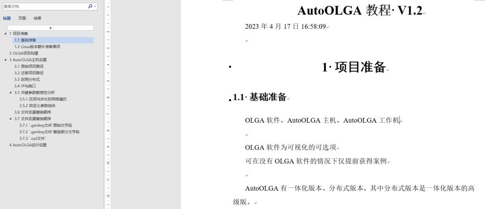

即插即用式全平台OLGA高维分布式参数搜索仿真系统 简而言之，我们构建了一个系统，能让斯伦贝谢(Schlumberger)OLGA多相瞬态流动模拟器，快速完成参数组合的流动运算。

[AutoOLGA教程](https://aiwellbore.com/wp-content/uploads/2023/04/AutoOLGA教程.docx "AutoOLGA教程")

比如想探索井场中不同井底参数、压力、温度等因素对于流动规律的影响。传统而言需要专家手动一次一次的排列组合，一次一次的反馈调整。这不仅浪费大量的精力，也使得长时间的流动计算降低了流动规律研究的进程。

为了进一步提高研究效率，更能适应人工智能时代大规模数据集构建，我们推出了一款全自动大规模的分布式系统来给领域研究者提供全新的解决方案。

举个例子，4因素，3尺度，敏感性分析，有3^4=81种组合方式，假设每个项目仅考虑计算时间（即忽略手动调整时间）需要30分钟，那么需要领域专家不休息的工作40多小时。（实际上参数组合方式动辄上千组） 而基于AutoOLGAFleet分布式系统，不仅在单机上可以进行多线程加速，更可以采用大量普通的电脑进行分布式加速。这种分布式的安装方法非常简单，甚至可以说点击就可以完成，因此具有即插即用的特性。比如在几台电脑运算时，忽然有人有空余的电脑，你都可以一键加入集群当中。 最简单的两台电脑，比如休闲笔记本和办公室的台式机，即可帮您减少一半的耗时，10台电脑在一起，用时仅需十分之一的成本，这很惊奇。 
